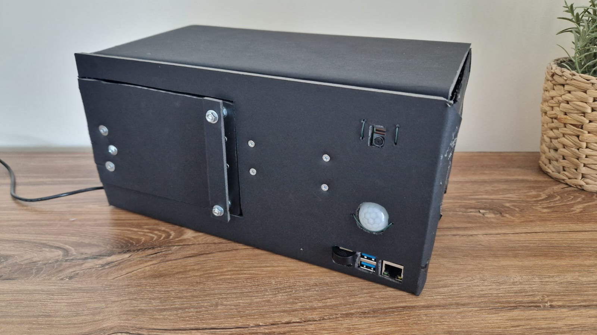
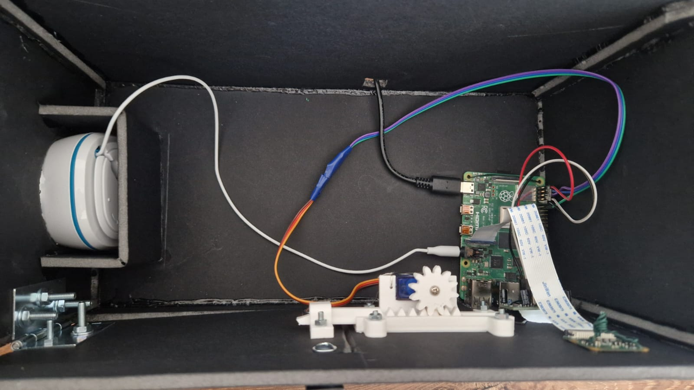
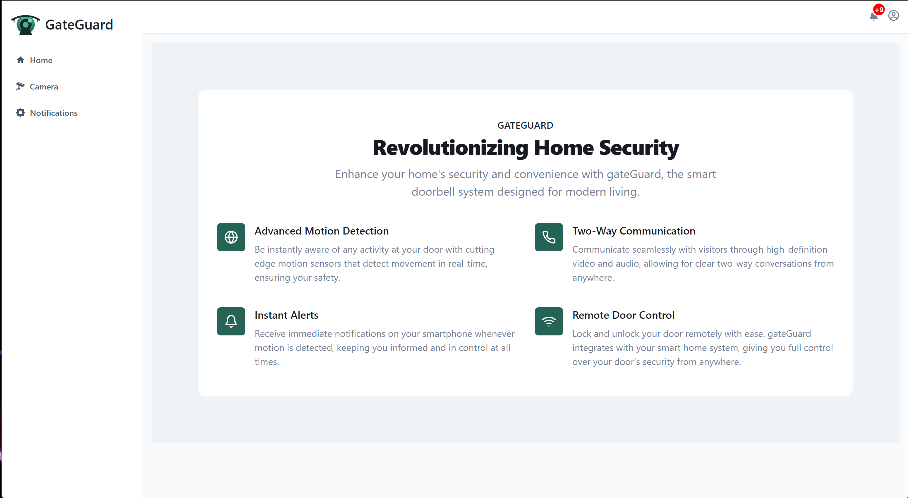
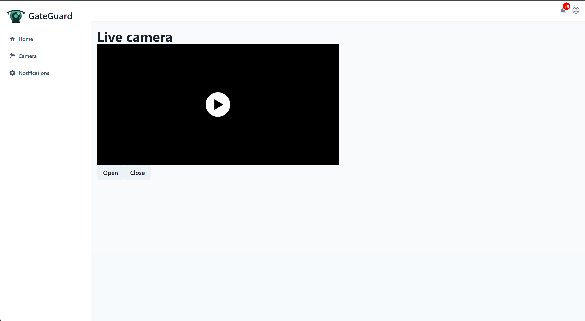
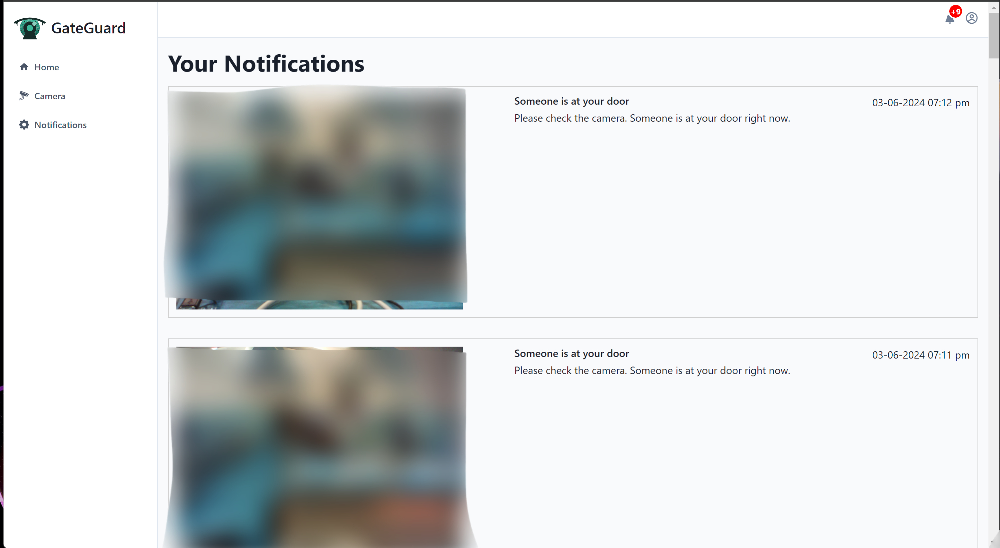

# Smart doorbell system

## Motivation
The purpose of this project is to create a device, equipped with advanced motion sensors, that is capable of notifying the user about the activity taking place outside the door, allowing two-way communication with visitors via built-in speakers and a microphone. I chose this project because of the learning opportunity it provides. I was able to improve my knowledge about IoT and networking, subjects I was interested in before. Also I had the possibility to integrate a machine leaning model and to deepen my robotics capability.

## Realtime Comunication
My prototype aims to reshape the basic security systems by enabling a remote two-way communication, using WebRTC, a technology that uses both TCP and UDP protocols to establish real-time communication. To achieve this type of connection on the Raspberry Pi, without using a browser, I chose to use [aioRTC](https://github.com/aiortc/aiortc), a Python library built on top of asyncio.

## People detection
This component does use an infrared sensor in order to detect motion and it captures a picture of the subject. Then, the image is analyzed by an efficient computer vision model that is specially implemented for people detection.If the model positively detects human presence, the user will instantly receive a notification. This property is provided by the realtime servers integrated in the backend.

## Remote door control
One of the revolutionary features is the remote door control option available on the web application, making it possible to open and close the door whenever you see fit.

## Pages:
Landing Page:

Home Page:

Camera Page:

Notifications Page:

## Technologies
### Web App
Front end:
- React 
- Chakra UI

Backend: 
- Supabase

### Pi server
- aioRTC

## Components
- RaspberryPi 4B
- Jack speaker
- USB microphone
- PiCamera
- Servo motor

## References:
[aioRTC](https://github.com/aiortc/aiortc)
[webRTC](https://webrtc.org/)
[sonkm3 example](https://github.com/sonkm3/aiortc-example)
